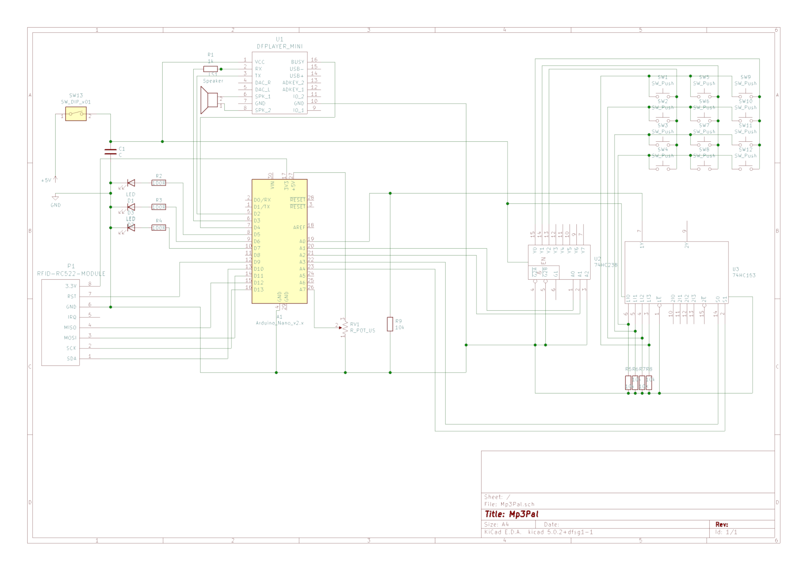

# MP3Pal
MP3 player for kids based tonunio and Hörbert design.

## Features

 * Plays audio from a SD Card
 * Select playlists via 12 buttons and rfid tags

## Part list

* Arduino Nano
* DFPlayer mini
* Speaker Visaton FR 10 HM
* Guitar Potentiometer
* 74HC238, 74HC153
* 9 Arcade buttons + 3 Acracde buttons with LED
* AZDelivery Battery Expansion Shield 18650
* 18650 Battery
* Göldo Dome Chrome
* Handle from DIY Store
* Resistors 5x 10k, 1x 1k, 3x 100
* 1 Capacitor 100 uF (optional)
* RFID tags, magnets and figures
* Threads for 3D prints (I use the ones from Ruthex) M2, M3, M4
* Wires
  - JST 2.5 Connectors & Wires
  - Mini Micro JST 2.0 (with cables & pin connectors)

… to be continued (but it's below 100 Euro - if you get it from ali express it's maybe ~50)

## Schematic

## Alternatives

Tonunio

https://www.voss.earth/tonuino/

KidsMP3Player

https://github.com/ghmartin77/KidsMP3Player
